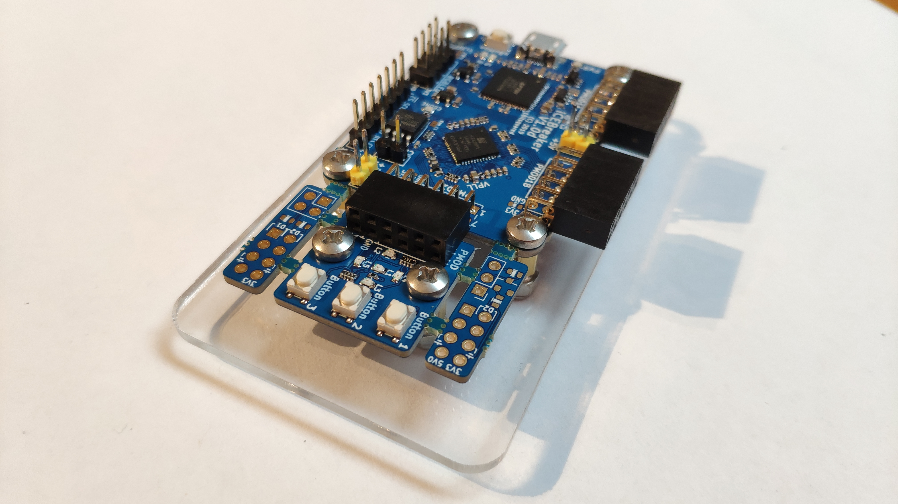

# Icebreaker FPGA Board Case

## Introduction
This is a simple laser cut baseplate for the Icebreaker FPGA board version 1.0c as sold here: https://www.crowdsupply.com/1bitsquared/icebreaker-fpga . 

## Assumptions
This case was made for an icebreaker board with the PMOD part in place or removed.

## Tools and parts needed
* Lasercutter
* Acrylic sheet, any thickness (3mm or 1/8" works well)
* 4/6 M3 nuts
* 4/6 M3 standoffs (5mm long pref)
* 4/6 M3 bolts (12mm works well but will need longer if the acyrlic is thicker or standoffs longer)
